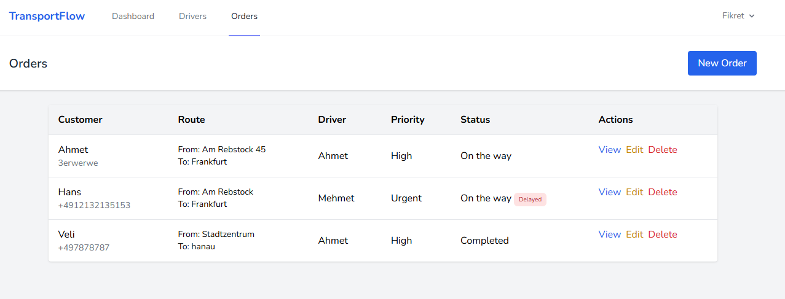
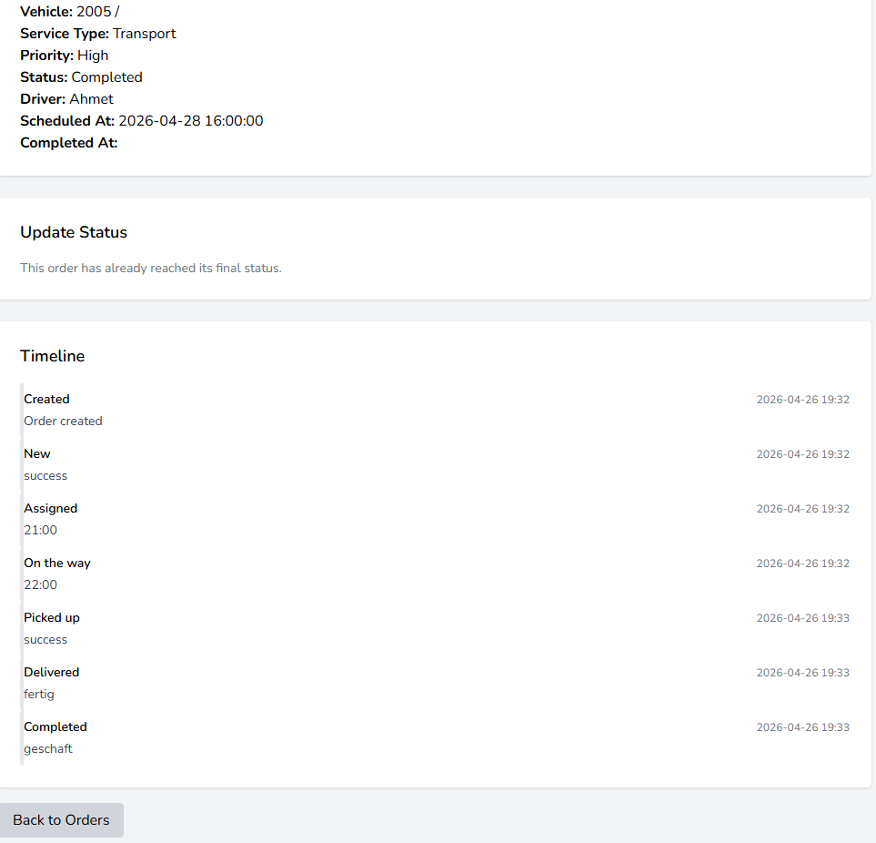
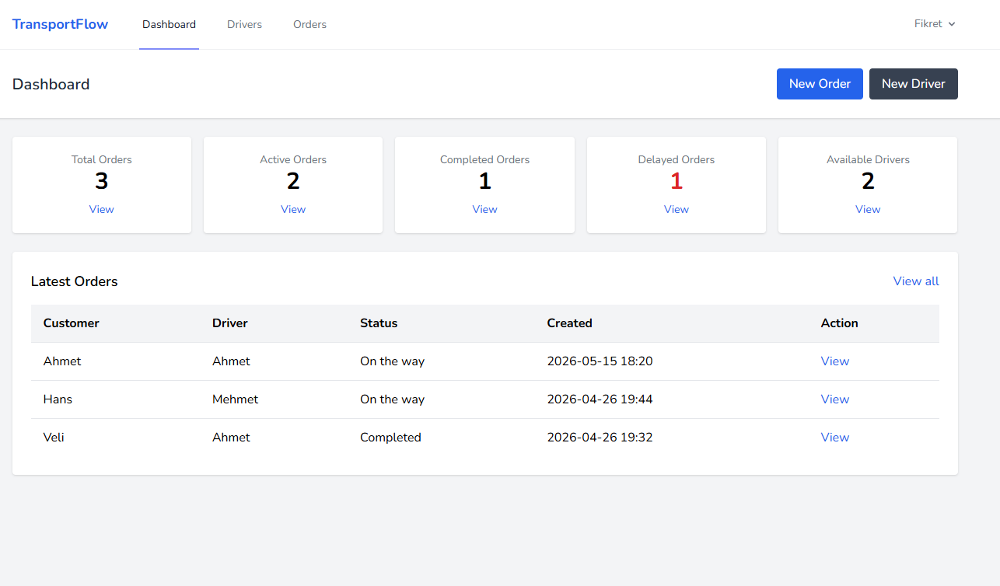

#  TransportFlow – Logistics Order Management Demo

##  Overview

TransportFlow is a simplified logistics order management system built with Laravel.

The goal of this project is to demonstrate backend design, workflow modeling, and event tracking rather than UI complexity.

---

##  Features

###  Driver Management

* Create, update, delete drivers
* Track driver availability
* Assign drivers to orders

###  Order Management

* Create transport orders
* Assign drivers
* Track full lifecycle of an order



###  Status Workflow

Orders follow a structured lifecycle:

```
new → assigned → on_the_way → picked_up → delivered → completed
```

###  Event Timeline

* Every important action is stored as an event
* Full history per order
* Example:

  * Order created
  * Driver assigned
  * Status updated



### ⚠ Risk Detection (Delayed Orders)

* Orders with past `scheduled_at` and not completed are flagged
* Displayed in dashboard and order views
* Helps identify operational risks

###  Dashboard

* Total Orders
* Active Orders
* Completed Orders
* Delayed Orders
* Available Drivers
* Quick navigation to filtered lists


---

##  Design Approach

This project intentionally goes beyond basic CRUD.

Focus areas:

* Workflow modeling
* State transitions
* Event-based tracking
* Operational visibility

> “The goal was to simulate a real-world logistics flow in a simple but structured way.”

---
## Architecture Concepts

- Workflow-based order lifecycle
- State transitions
- Event-driven order history
- Delayed order risk detection
- Operational dashboard visibility
- Separation of business logic from UI complexity
  
---

## 🛠 Tech Stack

* **Backend:** Laravel (PHP)
* **Database:** MySQL
* **Frontend:** Blade (Tailwind CSS)
* **Environment:** WAMP / PHP 8+

---

##  Getting Started

### 1. Clone project

```
git clone <repo-url>
cd transportflow
```

### 2. Install dependencies

```
composer install
npm install
npm run dev
```

### 3. Environment setup

```
cp .env.example .env
php artisan key:generate
```

Update database credentials in `.env`

### 4. Run migrations

```
php artisan migrate
```

### 5. Start server

```
php artisan serve
```

---

## Demo Login

```
Email: demo@transportflow.test  
Password: password
```

##  Demo Flow

1. Create a driver
2. Create an order
3. Assign a driver
4. Update status step by step
5. Observe timeline updates
6. Check dashboard for delayed orders

---
## Recent Improvements

- Added workflow transition validation
- Implemented controlled order state transitions
- Improved event timeline UI
- Added delayed order detection logic
- Added query scopes for active, completed and delayed orders
- Improved operational visibility for transport workflows

---
## Future Improvements

- Queue-based background processing
- REST API endpoints
- Docker support
- Role and permission management
- Webhook integration for external logistics systems
- Automated tests for order workflow transitions

---  
##  Notes

* This project focuses on backend workflow architecture and operational process modeling.
* Focus is on backend logic and system design
* UI is intentionally kept simple

---

##  Author

Fikret Aysel
Backend Developer (PHP / Laravel)

---
